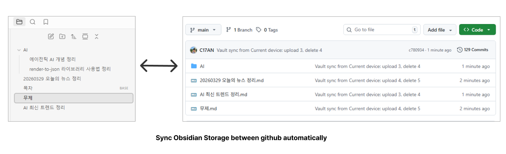

# GitHub Vault Sync

Obsidian 노트를 GitHub 저장소와 동기화해서 여러 환경의 Obsidian 사이에서 같은 글을 공유할 수 있는 플러그인입니다.  
`git` CLI 없이 GitHub REST API와 Obsidian Vault API만 사용하도록 설계해서 데스크톱과 모바일 환경 모두를 고려했습니다.

## 주요 기능

- GitHub 저장소를 동기화 원격지로 사용
- 초기 `Pull` / 초기 `Push` 분리 지원
- 이후 변경분만 반영하는 증분 양방향 sync
- 충돌 발생 시 conflict 사본 생성
- 주기적인 자동 sync 지원
- 페이지 포커스를 잃을 때 자동 sync 지원
- 마지막 sync 이후 1분 이내라면 포커스 이탈 sync 생략
- 모바일 Obsidian 호환 고려
- `owner/repo`, 저장소 이름, 전체 GitHub URL 입력 지원

## 이런 경우에 적합합니다

- PC와 모바일에서 같은 Obsidian 글을 이어서 작성하고 싶을 때
- Obsidian Vault 전체를 GitHub 기반으로 가볍게 공유하고 싶을 때
- 별도 Git 클라이언트 없이 노트 중심으로 동기화하고 싶을 때

## 설치

1. `npm install`
2. `npm run build`
3. `dist/` 안의 파일을 Obsidian vault의 `.obsidian/plugins/github-vault-sync/`에 복사
4. Obsidian Community Plugins에서 활성화

### 설치 스크립트

- Windows에서 `install.bat`를 실행하거나 `scripts/install.ps1`를 직접 실행할 수 있습니다.
- 또는 `npm run install:obsidian` 실행 후 vault 경로를 입력하면 `dist/` 파일이 자동으로 `.obsidian/plugins/github-vault-sync/`로 복사됩니다.

## 설정 항목

- `GitHub Owner`
- `GitHub Repository`
- `Branch`
- `Personal Access Token`
- `Repository Base Path`
- `Vault Base Path`
- `Auto Sync On Focus Loss`
- `Auto Sync Interval (minutes)`
- `Sync On Startup`

## 모바일 지원

이 플러그인은 `isDesktopOnly: false`로 구성되어 있으며, GitHub API 호출과 Obsidian API만 사용합니다.  
즉 모바일 Obsidian에서도 커뮤니티 플러그인을 사용할 수 있는 환경이라면 같은 방식으로 동작할 수 있습니다.
