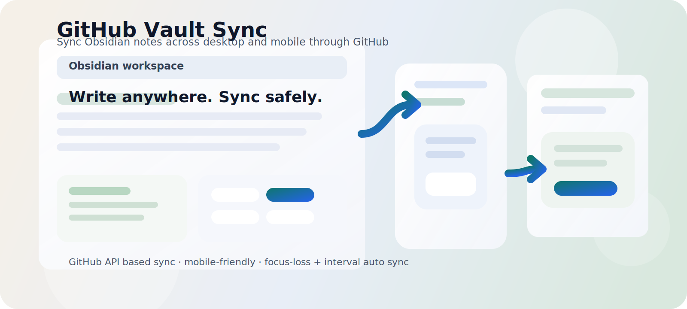

# GitHub Vault Sync



Obsidian 노트를 GitHub 저장소와 양방향으로 동기화하는 플러그인입니다.  
`git` CLI 대신 GitHub REST API와 Obsidian `Vault` API만 사용해서 데스크톱과 모바일 환경을 함께 겨냥했습니다.

## 프로젝트 소개

`GitHub Vault Sync`는 여러 기기에서 같은 Obsidian 볼트를 다루는 사용자를 위한 sync 플러그인입니다.

- GitHub 저장소를 단일 원격 소스로 사용
- 초기 `Pull` / `Push` 흐름 분리
- 이후에는 증분 양방향 sync
- 모바일 Obsidian까지 고려한 구현
- 충돌 시 conflict 사본 생성
- 주기 sync + 포커스 이탈 시 자동 sync

핵심 목표는 단순합니다.  
별도의 git 클라이언트나 데스크톱 전용 기능 없이, 노트를 GitHub에 안전하게 올리고 다른 환경에서 다시 받아볼 수 있게 만드는 것입니다.

## 주요 기능

- GitHub `owner/repo`, 전체 GitHub URL, 저장소 이름 형태 입력 지원
- 저장소 브랜치와 하위 경로 지정
- 볼트 전체 또는 특정 폴더만 sync
- 초기 `Pull` / 초기 `Push` 명령 제공
- 증분 양방향 sync
- conflict 사본 생성 및 원본 보존
- conflict 산출물은 이후 sync 계산에서 제외
- 주기 sync 유지
- 앱/페이지가 포커스를 잃을 때 자동 sync
- 마지막 성공 sync 후 1분 이내면 포커스 이탈 sync 생략
- 모바일 호환을 위해 Node/Electron 전용 API 미사용

## 어떻게 동작하나

### 1. 초기 연결

처음 연결할 때는 둘 중 하나를 먼저 실행합니다.

- `초기 Pull`
  - GitHub 저장소의 내용을 로컬 볼트로 가져옵니다.
- `초기 Push`
  - 현재 볼트의 내용을 GitHub 저장소로 업로드합니다.

초기 연결이 끝나면 파일별 상태를 추적하면서 증분 sync를 수행합니다.

### 2. 증분 sync

파일별로 아래 정보를 비교합니다.

- 마지막 sync 시의 로컬 내용 해시
- 마지막 sync 시의 원격 blob SHA
- 현재 로컬 내용
- 현재 원격 blob SHA

판단 방식은 다음과 같습니다.

- 로컬만 바뀌면 업로드
- 원격만 바뀌면 다운로드
- 둘 다 바뀌면 conflict 사본을 만들고 로컬 파일을 메인으로 유지
- 로컬 삭제가 확정되면 원격도 삭제
- 원격 삭제가 확정되면 로컬도 삭제

### 3. 자동 sync 트리거

자동 sync는 두 방식으로 동작합니다.

- 주기 sync
  - 설정한 분 단위 간격으로 실행
- 포커스 이탈 sync
  - 앱 또는 페이지가 포커스를 잃을 때 실행
  - 단, 마지막 성공 sync 후 1분이 지나지 않았으면 건너뜀

이 구조는 저장 중마다 push가 발생하는 문제를 줄이면서, 사용자가 다른 앱으로 이동할 때 자연스럽게 sync되도록 설계했습니다.

## 모바일 호환성

이 플러그인은 모바일 Obsidian 사용을 고려해 구현되었습니다.

- `isDesktopOnly: false`
- `requestUrl` 기반 GitHub API 호출
- Obsidian `Vault` API만 사용
- `fs`, `path`, `child_process`, shell 의존성 없음

즉, 모바일 Obsidian에서 Community Plugin을 사용할 수 있고 vault의 플러그인 폴더에 파일을 배치할 수 있다면 같은 플러그인을 그대로 사용할 수 있습니다.

## 설치

현재는 저장소에서 직접 배포하는 형태를 기준으로 합니다.

1. 프로젝트를 빌드합니다.

```bash
npm install
npm run build
```

2. 아래 파일을 Obsidian vault의 `.obsidian/plugins/github-vault-sync/`에 복사합니다.

- `dist/main.js`
- `dist/manifest.json`
- `dist/styles.css`
- `dist/versions.json`

3. Obsidian에서 Community Plugins를 활성화하고 플러그인을 켭니다.

## 설정 항목

- `GitHub Owner`
- `GitHub Repository`
- `Branch`
- `Personal Access Token`
- `Repository Base Path`
- `Vault Base Path`
- `Include Extensions`
- `Exclude Paths`
- `Device Name`
- `Auto Sync On Focus Loss`
- `Auto Sync Interval (minutes)`
- `Sync On Startup`
- `Create Conflict Copies`

## 사용 예시

### 새 저장소를 기준으로 볼트 받아오기

1. 저장소 정보와 토큰 입력
2. `초기 Pull` 실행
3. 이후에는 주기 sync 또는 포커스 이탈 sync 사용

### 현재 볼트를 GitHub에 올려서 다른 기기와 공유하기

1. 저장소 정보와 토큰 입력
2. `초기 Push` 실행
3. 다른 기기에서는 같은 저장소로 `초기 Pull`

## 프로젝트 구조

```text
src/
  main.ts           플러그인 진입점, 설정 UI, 자동 sync 트리거
  sync-engine.ts    파일 비교, 충돌 처리, sync 오케스트레이션
  github-api.ts     GitHub REST API 래퍼
  utils.ts          경로/파싱/해시 유틸리티
dist/
  main.js
  manifest.json
  styles.css
  versions.json
docs/
  banner.svg
```

## 한계와 주의사항

- GitHub 저장소는 최소 1개의 초기 커밋이 있어야 합니다.
- 기본적으로 텍스트 파일(`.md`, `.canvas`, `.txt`) 중심으로 설계되어 있습니다.
- 대용량 바이너리까지 완전한 vault mirror가 필요하면 별도 전략이 필요합니다.
- 여러 기기에서 같은 파일을 매우 짧은 간격으로 동시에 수정하면 fast-forward 재시도가 반복될 수 있습니다.

## 개발 메모

- 빌드 산출물은 `dist/`에 생성됩니다.
- 설정 UI에는 `Pretendard` 폰트를 적용했습니다.
- Quick Actions는 모바일 화면에서도 잘리지 않도록 반응형으로 배치됩니다.

## 라이선스

프로젝트 라이선스는 [package.json](package.json)을 기준으로 `MIT`입니다.
